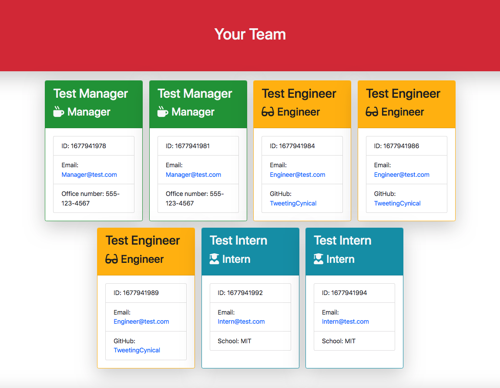

# Team Profile Generator


## A simple command line application for generating a Team profile using an employee class with extensions for Manager, Engineer and Intern. This package uses Inquirer and Jest.

<!-- TABLE OF CONTENTS -->
  <details>
    <summary>Table of Contents</summary>
    <ol>
          <li><a href="#about-the-project">About The Project</a></li>
          <li><a href="#deployment">Deployment / Code Repository</a></li>
          <li><a href="#screenshot">Screenshot</a></li>
          <li><a href="#scope-and-purpose">Scope and Purpose</a></li>
          <li><a href="#usage">Usage</a></li>
          <li><a href="#credits">Credits</a></li>
          <li><a href="#installation">Installation</a></li>
          <li><a href="#questions">Questions</a></li>
          <li><a href="#contributions">Contributions</a></li>
          <li><a href="#tests">Tests</a></li>
          <li><a href="#suggested-future-changes">Suggested Future Changes</a></li>
          <li><a href="#license">License</a></li>
        </ol>
  </details>

  <!-- About the Project -->

## About the Project

### Deployment / Code Repository

[Live Deployment](https://TweetingCynical.github.io/team-profile-generator/)

[Repository](https://github.com/TweetingCynical/team-profile-generator)

### Screenshot

Working version of the app should look like this:


Finished Team Profile should look like this:


### Scope and Purpose

Build an interactive command line app which collects details from a user in order to build a personalised TEAM PROFILE in html. The app should use a class of Employee, and then be able to add details of Managers, Engineers and Interns within the company, to create a card for each on the final team.html page. The app will automatically generate the content, and store it as a named file within the output folder of the repo.

### Usage

This site and its contents are for educational purposes only. You should have Node.js installed to be able to run this program.

### Credits

The following people have contributed to this app:

- [TweetingCynical](https://github.com/TweetingCynical)

### Installation

To install the necessary tendencies, you must run the following command:

```
npm i
```

### Questions

If you have any questions or to report bugs, please [open a new issue](https://github.com/TweetingCynical/team-profile-generator/issues/new) or [email us](mailto:jon@exce-ed.com?subject=team-profile-generator)

You can find more of my work at https://github.com/TweetingCynical

### Contributing

Please create a fork to contribute to our project.

### Tests

To run tests, run the following command:

```
npm test
```

### Suggested Future Changes

- ✅ ~~Add colour coded cards to the employee type;~~
- ✅ ~~Use DRY principle to reuse the createRole function for each role type, allowing questions to be asked only if they are relevant to the role;~~
- Ability to upload photographs for each employee;
- Consider additional tests needed for edge cases;
- Add hierarchy options to allow managers to see the employees who operate underneath them;

### License

MIT License

Copyright (c) 2023 TweetingCynical

Permission is hereby granted, free of charge, to any person obtaining a copy
of this software and associated documentation files (the "Software"), to deal
in the Software without restriction, including without limitation the rights
to use, copy, modify, merge, publish, distribute, sublicense, and/or sell
copies of the Software, and to permit persons to whom the Software is
furnished to do so, subject to the following conditions:

The above copyright notice and this permission notice shall be included in all
copies or substantial portions of the Software.

THE SOFTWARE IS PROVIDED "AS IS", WITHOUT WARRANTY OF ANY KIND, EXPRESS OR
IMPLIED, INCLUDING BUT NOT LIMITED TO THE WARRANTIES OF MERCHANTABILITY,
FITNESS FOR A PARTICULAR PURPOSE AND NONINFRINGEMENT. IN NO EVENT SHALL THE
AUTHORS OR COPYRIGHT HOLDERS BE LIABLE FOR ANY CLAIM, DAMAGES OR OTHER
LIABILITY, WHETHER IN AN ACTION OF CONTRACT, TORT OR OTHERWISE, ARISING FROM,
OUT OF OR IN CONNECTION WITH THE SOFTWARE OR THE USE OR OTHER DEALINGS IN THE
SOFTWARE.
